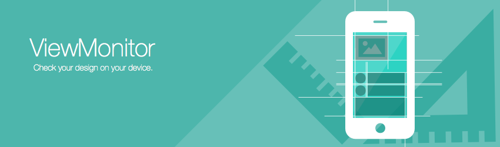
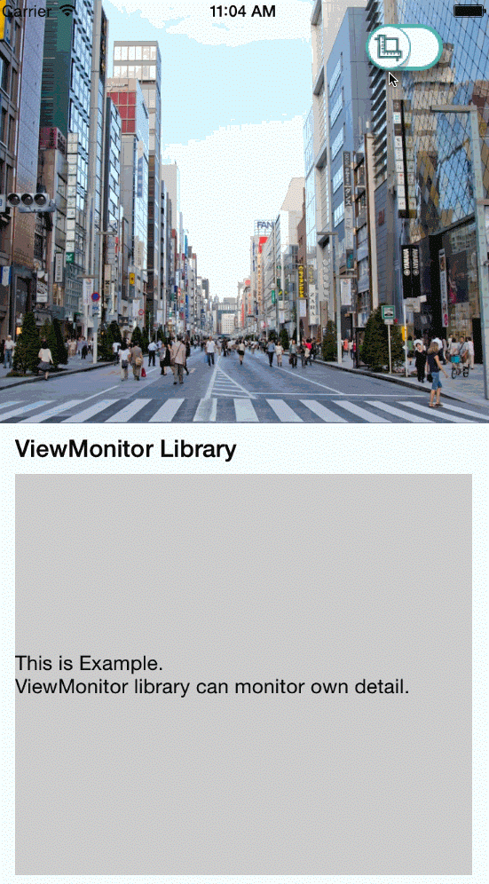

[](http://cocoapods.org/pods/ViewMonitor)
[](http://cocoapods.org/pods/ViewMonitor)


## What's ViewMonitor
ViewMonitor can measure view positions with accuracy.
This library is to check design sheet from native app.

behave like this.

- UIViewController



- UITableViewController


## Usage

To run the example project, clone the repo.

## Requirements
- iOS 8.0+
- Xcode 7.0+

## Installation
### cocoaPods
ViewMonitor is available through [CocoaPods](http://cocoapods.org). To install
it, simply add the following line in your Podfile:
```ruby
pod "ViewMonitor"
```
This library use swift.
So, you have to add `use_frameworks!` in Podfile.

after that, please run 
```ruby
pod install
```
### Carthage
To install, you can also use [Carthage](https://github.com/Carthage/Carthage).

You can install Carthage with [Homebrew](http://brew.sh/).
```
$ brew update
$ brew install carthage
```
To integrate ViewMonitor into your Xcode project using Carthage, write the following line in your Cartfile.
```
github "daisuke0131/ViewMonitor"
```
### Manually
If you don't use CocoaPods and Carthage, you should add `Source/*` files in your project.

## How to use
#### For Swift Project

First, ```import ViewMonitor```

Execute ```ViewMonitor.start()``` after application started. 
Like this
```
import ViewMonitor

func application(application: UIApplication, didFinishLaunchingWithOptions launchOptions: [NSObject: AnyObject]?) -> Bool {
  ViewMonitor.start()
  return true
}
```
After that, execution button appear.

Please, refer to Example/ViewMonitorExample

#### For Objective-C Project
Add bridge-header in your project.
Add ```#import "YourProjectName-Swift.h"``` in your project.

Import ViewMonitor,
```@import ViewMonitor```

Execute ```[ViewMonitor start]``` after application started. 
Like this
```
#import "YourProjectName-Swift.h"
@import ViewMonitor;

- (BOOL)application:(UIApplication *)application didFinishLaunchingWithOptions:(NSDictionary *)launchOptions {
    // Override point for customization after application launch.
    [ViewMonitor start];
    return YES;
}
```
After that, execution button appear.

Please, refer to Example/ViewMonitorObjcExample

## Author
### developer
[Daisuke Yamashita](https://github.com/daisuke0131)
### designer
[Satomi Nogawa](https://github.com/stmngw)

## License
ViewMonitor is available under the MIT license. See the LICENSE file for more info.

## Other
[How to measure UIView position on Native App](http://www.slideshare.net/daisukeyamashita180/18potatotips-yamashita) at potatotips #18
