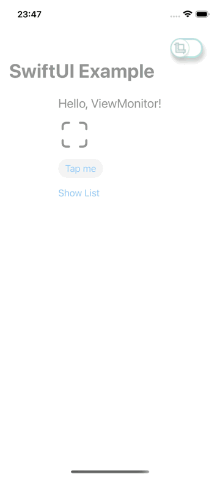

<p align="center">
  
</p>

# ViewMonitor — In-app visual layout inspector for iOS

<p align="center">
  <a href="https://github.com/daisuke0131/ViewMonitor/actions/workflows/ci.yml"></a>
  
  
  
  <a href="https://cocoapods.org/pods/ViewMonitor"></a>
  <a href="LICENSE"></a>
</p>

**Inspect UIKit and SwiftUI layouts directly inside your app. Measure frames, spacing, insets, and view properties with a few taps.**

<p align="center">
  
</p>

## Why ViewMonitor

- **Inspect the running UI.** Check layout values without switching to Xcode's View Debugger.
- **Verify UIKit and SwiftUI together.** Measure UIKit views, SwiftUI accessibility elements, or a pair containing both.
- **Compare two elements.** See edge-to-edge gaps, overlap, or containment insets after two taps.
- **Read implementation details.** Inspect frames, colors, alpha, corner radius, text, and font properties when the framework exposes them.
- **Shorten design QA.** Compare a design specification with the implementation directly on a simulator or device.

## Quick Start

### 1. Add the package

In Xcode, choose **File > Add Package Dependencies** and enter:

```text
https://github.com/daisuke0131/ViewMonitor.git
```

Or add ViewMonitor to `Package.swift`:

```swift
dependencies: [
    .package(
        url: "https://github.com/daisuke0131/ViewMonitor.git",
        from: "2.0.0"
    )
]
```

### 2. Start ViewMonitor

#### SwiftUI

Enable SwiftUI element detection in a debug build, then attach `.viewMonitor()` to the root view:

```swift
import SwiftUI
import ViewMonitor

@main
struct MyApp: App {
    init() {
        ViewMonitor.enableSwiftUIElementDetection()
    }

    var body: some Scene {
        WindowGroup {
            ContentView()
                .viewMonitor()
        }
    }
}
```

#### UIKit

Call `ViewMonitor.start()` after the app has a window:

```swift
import UIKit
import ViewMonitor

class SceneDelegate: UIResponder, UIWindowSceneDelegate {
    func scene(
        _ scene: UIScene,
        willConnectTo session: UISceneSession,
        options connectionOptions: UIScene.ConnectionOptions
    ) {
        ViewMonitor.start()
    }
}
```

Tap the ViewMonitor button in the top-right corner to enter measurement mode.

## What You Can Inspect

| Capability | UIKit | SwiftUI |
| --- | --- | --- |
| Position and size | Yes | Yes |
| Text content | Labels and buttons | Published accessibility text |
| Background, alpha, corner radius | Yes | Not available |
| Font family, size, color | Labels and button titles | Not available |
| Gap, overlap, containment insets | Yes | Yes, including UIKit-to-SwiftUI comparisons |

ViewMonitor detects common UIKit controls such as labels, image views, and buttons, plus the accessibility elements published by SwiftUI.

## Measure Relationships Between Views

Select one element, then select another. The previous element receives a blue outline, the current element receives a red outline, and the info panel describes their relationship:

- `gapX` / `gapY` — edge-to-edge spacing when the elements are separated.
- `overlapX` / `overlapY` — overlap on each axis when their frames intersect.
- `top` / `left` / `bottom` / `right` — inner insets when one frame contains the other.

The values come from the frames shown in the running app, so the same flow works for UIKit-to-UIKit, SwiftUI-to-SwiftUI, and UIKit-to-SwiftUI comparisons.

## Measurement Mode

While measurement mode is on:

- Tap an overlay button to inspect that element.
- ViewMonitor blocks touches from reaching the app, preventing accidental navigation, actions, or scrolling.
- Overlay buttons stay at the positions captured when measurement started.
- Rotation and programmatic screen changes keep measurement mode on, re-scan the new screen, and clear the previous selection.

To scroll or interact with the app, turn measurement mode off, move to the desired state, then turn it on again.

## SwiftUI Detection and Limitations

ViewMonitor inspects the accessibility elements that SwiftUI publishes for `Text`, `Image`, `Button`, list rows, and other accessible content. Your views do not need ViewMonitor-specific modifiers beyond the root `.viewMonitor()` startup modifier.

<details>
<summary>Why SwiftUI detection must be enabled in debug builds</summary>

iOS builds the SwiftUI accessibility tree only while an accessibility client is active. `ViewMonitor.enableSwiftUIElementDetection()` activates that tree from inside the process so the overlay can find SwiftUI elements without VoiceOver or Accessibility Inspector attached.

The helper relies on a private accessibility API and is therefore compiled into **debug builds only**. In release builds it is a no-op that returns `false`, and the private symbol names are not included in the binary. As an alternative, attach Xcode's Accessibility Inspector or enable VoiceOver, then reopen the screen.

If ViewMonitor finds SwiftUI content but no accessibility elements, the info panel displays these instructions instead of failing silently.

SwiftUI limitations:

- Position, size, element type, and published text are available; font, background, alpha, and corner radius are not.
- Views using `.accessibilityElement(children: .combine)` are measured as one element.
- Views using `.accessibilityHidden(true)` are not detected.

</details>

## Examples

- SwiftUI lifecycle example: `Example/ViewMonitorSwiftUIExample`
- UIKit lifecycle example: `Example/ViewMonitorExample`

Both examples run on the simulator as-is. For a physical device, create a git-ignored `Local.xcconfig` next to the example you want to run and set your Apple Developer Team ID:

```sh
echo 'DEVELOPMENT_TEAM = XXXXXXXXXX' > Example/ViewMonitorExample/Local.xcconfig
echo 'DEVELOPMENT_TEAM = XXXXXXXXXX' > Example/ViewMonitorSwiftUIExample/Local.xcconfig
```

### UIKit examples

| View controller | Table view controller |
| --- | --- |
|  |  |

## Requirements

- iOS 15.0+
- Xcode 26.0+
- Swift 6.0+

## CocoaPods

ViewMonitor is also available through [CocoaPods](https://cocoapods.org/pods/ViewMonitor):

```ruby
pod "ViewMonitor"
```

Then run `pod install`.

## Authors

- Developer: [Daisuke Yamashita](https://github.com/daisuke0131)
- Designer: [Satomi Nogawa](https://github.com/stmngw)

## History

ViewMonitor began in 2015 and was revived in 2026 with Swift 6, Swift Package Manager, modern scene support, two-view measurement, and SwiftUI inspection. See the [changelog](CHANGELOG.md) for release details.

The original presentation, [How to measure UIView position on Native App](https://www.slideshare.net/daisukeyamashita180/18potatotips-yamashita), was given at potatotips #18.

## License

ViewMonitor is available under the MIT license. See [LICENSE](LICENSE) for details.
