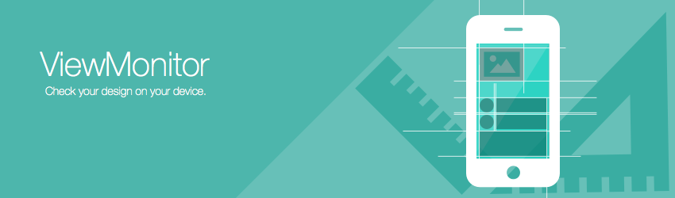
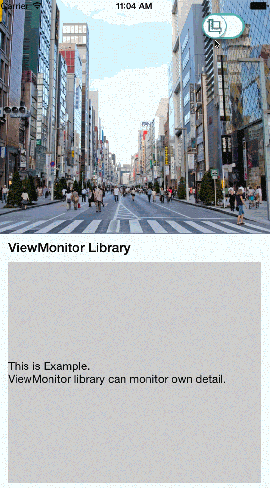
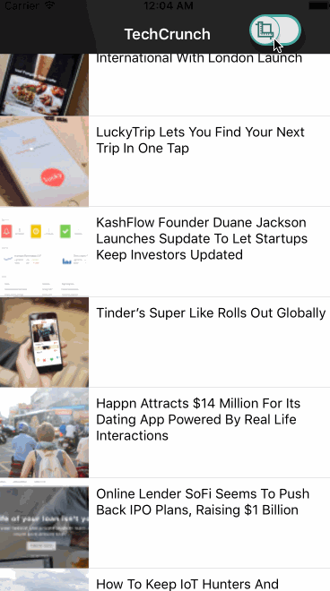

[](http://cocoapods.org/pods/ViewMonitor)
[](http://cocoapods.org/pods/ViewMonitor)

## What's ViewMonitor

ViewMonitor can measure view positions with accuracy.
This library is to check design sheet from native app.
behave like this.

- UIViewController
  
- UITableViewController
  

## Requirements

- iOS 15.0+
- Xcode 26.0+
- Swift 6.0+

## Installation

### Swift Package Manager

In Xcode, go to File > Add Package Dependencies and add the following URL.

```
https://github.com/daisuke0131/ViewMonitor.git
```

If you're using `Package.swift` directly, add it as follows:

```swift
dependencies: [
    .package(url: "https://github.com/daisuke0131/ViewMonitor.git", from: "2.0.0")
]
```

### cocoaPods

ViewMonitor is available through [CocoaPods](http://cocoapods.org). To install
it, simply add the following line in your Podfile:

```ruby
pod "ViewMonitor"
```

This library use swift.
So, you have to add `use_frameworks!` in Podfile.
after that, please run

```ruby
pod install
```

## How to use

Call `ViewMonitor.start()` after your app has launched.

```swift
import ViewMonitor

class SceneDelegate: UIResponder, UIWindowSceneDelegate {
    func scene(
        _ scene: UIScene,
        willConnectTo session: UISceneSession,
        options connectionOptions: UIScene.ConnectionOptions
    ) {
        ViewMonitor.start()
    }
}
```

Once running, tap the button that appears in the top-right corner of the screen to start measuring.
A working sample project is available at `Example/ViewMonitorExample`.

While measuring is ON, touches on the app itself are blocked so that
accidental taps cannot navigate away, fire actions, or scroll the content
(a screen transition would discard the measurement overlay). Only
ViewMonitor's own UI — the measurement buttons, the info panel, and the
toggle — receives touches. Measurement buttons are pinned at the positions
captured when the toggle was turned ON, and if the screen still changes
while measuring (e.g. a programmatic transition), the overlay closes and
the toggle returns to OFF. To interact with the app (e.g. scroll a list to
measure items further down), toggle OFF, move the screen, then toggle ON
again to re-scan.

### SwiftUI

For apps using the SwiftUI lifecycle (`@main App`), attach `.viewMonitor()`
to the root view:

```swift
import SwiftUI
import ViewMonitor

@main
struct MyApp: App {
    init() {
        ViewMonitor.enableSwiftUIElementDetection()
    }

    var body: some Scene {
        WindowGroup {
            ContentView()
                .viewMonitor()
        }
    }
}
```

Calling `ViewMonitor.start()` from `App.init()` also works.

SwiftUI's `Text`, `Image`, and `Button` are detected through the
accessibility elements SwiftUI publishes, so measurement works without any
changes to your views. A SwiftUI sample project is available at
`Example/ViewMonitorSwiftUIExample`.

iOS builds the accessibility tree only while an accessibility client is
active, so without further setup no monitor buttons appear over SwiftUI
views. Enable detection in one of these ways:

- Call `ViewMonitor.enableSwiftUIElementDetection()` once at startup, as in
  the snippet above (before or after `start()`, either is fine). This works
  in **debug builds only**: it relies on a private accessibility API
  internally, so in release builds the implementation is compiled out —
  the call is a no-op that returns `false`, and no private-API symbol
  names remain in the binary.
- Alternatively, attach Xcode's Accessibility Inspector (Xcode > Open
  Developer Tool > Accessibility Inspector) or enable VoiceOver, then
  reopen the screen.

When ViewMonitor finds SwiftUI content but no accessibility elements, the
info panel shows a notice with these instructions instead of failing
silently.

Known limitations for SwiftUI elements:

- Measured values are limited to position, size, and text content
  (font / background / cornerRadius show `None`).
- Views combined with `.accessibilityElement(children: .combine)` are
  measured as a single element, and `.accessibilityHidden(true)` views are
  not detected.

### Running the samples on a device

The samples run on the simulator as-is. To run one on a physical device,
code signing needs your own team, so create a `Local.xcconfig` (git-ignored)
next to the example you want to run, with your Team ID, before hitting Run:

```sh
echo 'DEVELOPMENT_TEAM = XXXXXXXXXX' > Example/ViewMonitorExample/Local.xcconfig
echo 'DEVELOPMENT_TEAM = XXXXXXXXXX' > Example/ViewMonitorSwiftUIExample/Local.xcconfig
```

## Author

### developer

[Daisuke Yamashita](https://github.com/daisuke0131)

### designer

[Satomi Nogawa](https://github.com/stmngw)

## License

ViewMonitor is available under the MIT license. See the LICENSE file for more info.

## Other

[How to measure UIView position on Native App](http://www.slideshare.net/daisukeyamashita180/18potatotips-yamashita) at potatotips #18
